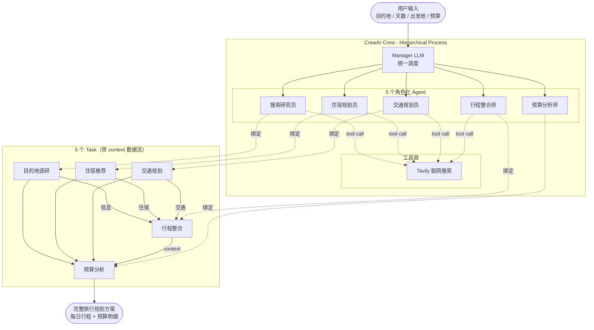

# 多 Agent 协作智能旅行规划系统


> 基于 **CrewAI** 的多 Agent 协作智能旅行规划系统：输入目的地、天数、出发地与预算，5 个角色化 Agent 分工协作，自动产出含每日行程、住宿、交通与预算明细的完整旅行规划方案。

---

## 功能特性

- **多 Agent 协作**：5 个角色化 Agent（搜索研究员、住宿规划员、交通规划员、行程整合师、预算分析师）分工明确，模拟真实旅行规划团队。
- **层级式编排**：采用 CrewAI **Hierarchical Process**，由 Manager LLM 统一调度各 Agent，自动决定任务分配与执行顺序。
- **联网工具调用**：通过 `@tool` 装饰器集成 **Tavily 搜索**，赋予 Agent 实时检索景点、美食、住宿、交通等动态信息的能力，落地 Tool Use / Function Calling 范式。
- **任务依赖编排**：利用 Task 的 `context` 机制实现 Agent 间数据流——预算分析任务聚合前 4 个任务的输出，形成「调研 → 规划 → 核算」的协作链路。
- **动态参数注入**：Task 描述支持 `{destination}`、`{days}`、`{budget}` 等占位符，灵活适配任意目的地与预算组合。
- **国产 LLM 接入**：对接通义千问 `qwen-plus`（OpenAI 兼容接口），完成 API Key 安全管理与环境变量校验。
- **双入口交付**：提供 **Streamlit Web UI** 与 **CLI 命令行**两种使用方式，支持结果导出为 Markdown 文件。

---

## 系统架构



---

## Agent 角色与职责

| Agent | 角色 | 职责 |
|-------|------|------|
| `researcher` | 搜索研究员 | 联网检索目的地的景点、美食、文化活动、购物、最佳旅行季节等信息 |
| `hotel_planner` | 住宿规划员 | 按经济型 / 舒适型 / 豪华型分档推荐住宿方案 |
| `transport_planner` | 交通规划员 | 规划国际航班、机场交通、市内交通及优惠通票 |
| `itinerary_planner` | 行程整合师 | 综合各方信息，制定每日行程表与实用贴士 |
| `budget_analyst` | 预算分析师 | 基于前序 Agent 输出，制定分项预算分配与省钱建议 |

---

## 项目结构

```
travel-agent/
├── src/
│   ├── agents.py        # Agent 定义：5 个角色化 Agent + LLM 实例
│   ├── tasks.py         # Task 定义：5 个任务 + context 依赖编排
│   ├── crew.py          # Crew 编排：Hierarchical Process + Manager LLM
│   ├── tools.py         # 工具配置：Tavily 联网搜索（@tool 装饰器）
│   ├── budget.py        # 预算分类常量
│   ├── app.py           # Streamlit Web UI 入口
│   └── main.py          # CLI 命令行入口
├── .env.example         # 环境变量示例
├── .gitignore
├── requirements.txt     # 依赖清单
└── README.md
```

---

## 技术栈

| 类别 | 技术 | 说明 |
|------|------|------|
| Agent 框架 | CrewAI ≥ 0.30 | 多 Agent 编排与 Hierarchical Process |
| LLM | 通义千问 `qwen-plus` | 阿里云 DashScope，OpenAI 兼容接口 |
| 联网搜索 | Tavily ≥ 0.3 | 为 Agent 提供实时信息检索能力 |
| Web UI | Streamlit ≥ 1.40 | 可视化参数输入与结果展示 |
| 配置管理 | python-dotenv ≥ 1.0 | `.env` 环境变量加载 |
| 异步支持 | nest-asyncio ≥ 1.6 | 解决事件循环嵌套问题 |
| 语言 | Python 3.10+ | 使用 `X | None` 类型注解语法 |

---

## 快速开始

### 1. 环境要求

- Python 3.10 或以上
- 通义千问 API Key（[获取地址](https://dashscope.aliyun.com/)）
- Tavily API Key（[获取地址](https://tavily.com/)）

### 2. 安装依赖

```bash
pip install -r requirements.txt
```

### 3. 配置环境变量

复制 `.env.example` 为 `.env`，并填入你的 API Key：

```bash
cp .env.example .env
```

```env
DASHSCOPE_API_KEY=your_dashscope_api_key_here
TAVILY_API_KEY=your_tavily_api_key_here
LLM_MODEL=qwen-plus
```

### 4. 运行

**CLI 命令行方式：**

```bash
python -m src.main
```

按提示输入目的地、天数、出发城市与预算即可。

**Streamlit Web UI 方式：**

```bash
streamlit run src/app.py
```

在浏览器侧边栏填写参数，点击「开始规划」按钮启动 Agent 团队。

---

## 使用示例

**示例输入：**

| 参数 | 值 |
|------|----|
| 目的地 | 东京 |
| 旅行天数 | 7 |
| 出发城市 | 北京 |
| 总预算 | 10000 元 |

**示例输出（节选）：**

```markdown
# 东京旅行规划

## 每日行程
### Day 1 - 抵达东京
- 下午：浅草寺 + 仲见世商业街（门票免费）
- 晚上：居酒屋晚餐（人均 150 元）
...

## 住宿推荐
- 经济型：XXX 酒店（约 450 元/晚）
- 舒适型：XXX 酒店（约 800 元/晚）

## 交通方案
- 国际航班：北京 → 东京（约 2500 元）
- 市内交通：地铁 + JR Pass（日均 80 元）

## 预算明细
| 类别 | 预估花费 |
|------|---------|
| 交通 | 3100 元 |
| 住宿 | 3150 元 |
| 餐饮 | 1400 元 |
| 门票 | 500 元 |
| 购物 | 1500 元 |
| 合计 | 9650 元（结余 350 元）|
```

---

## 配置说明

| 环境变量 | 必填 | 说明 |
|---------|------|------|
| `DASHSCOPE_API_KEY` | 是 | 通义千问 API Key |
| `TAVILY_API_KEY` | 是 | Tavily 搜索 API Key |
| `LLM_MODEL` | 否 | 使用的模型，默认 `qwen-plus` |

---

## License

本项目采用 MIT License。

---

## 作者

**ppppppz**

GitHub: [@Aria-zzz](https://github.com/Aria-zzz)
仓库: [Aria-zzz/ppppppz](https://github.com/Aria-zzz/ppppppz)
